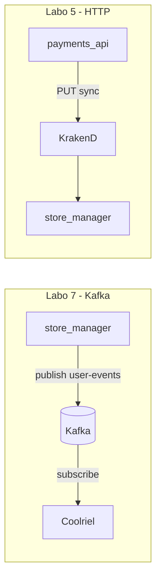
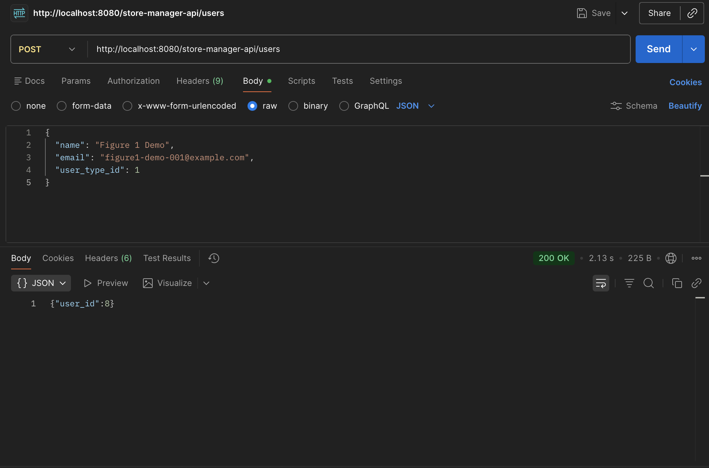
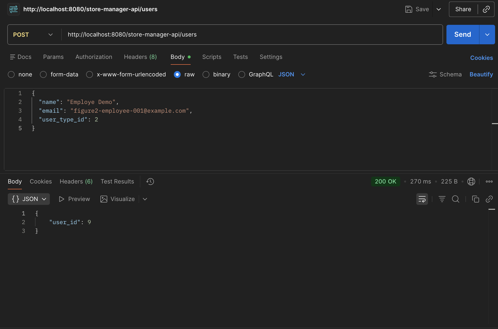
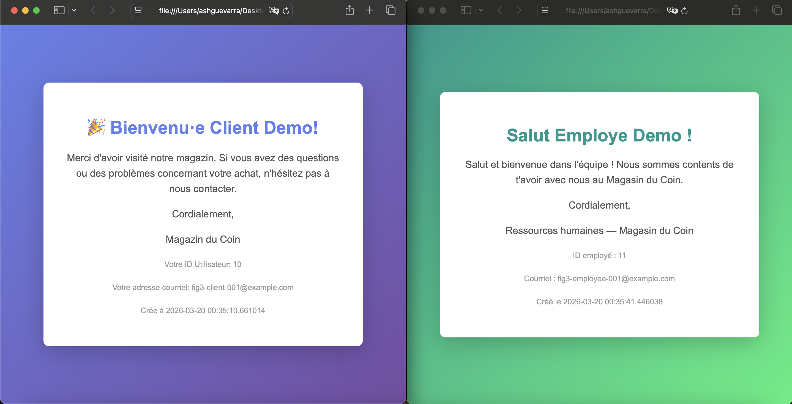
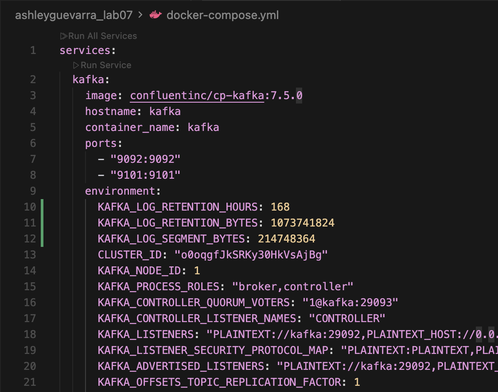
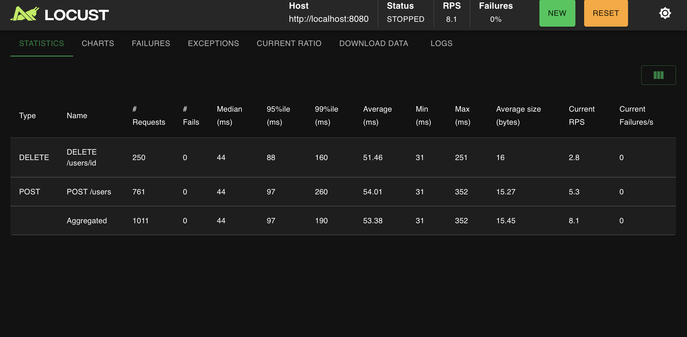
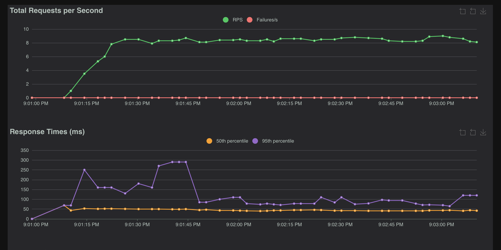
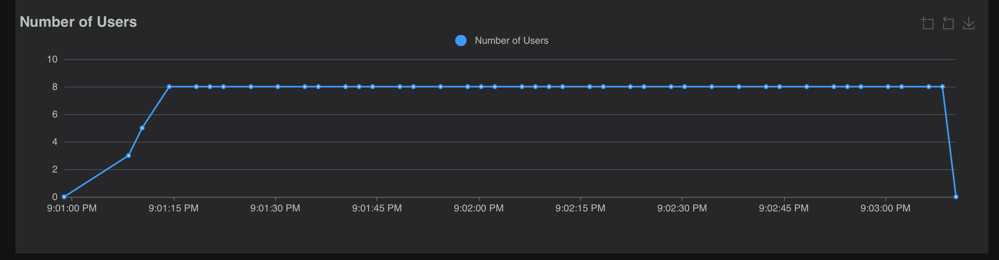

<div align="center">

<h3 style="text-align:center; font-size:14pt;">
ÉCOLE DE TECHNOLOGIE SUPÉRIEURE<br>
UNIVERSITÉ DU QUÉBEC
</h3>

<br><br>

<h3 style="text-align:center; font-size:15pt;">
RAPPORT DE LABORATOIRE <br> 
PRÉSENTÉ À <br> 
M. FABIO PETRILLO <br> 
DANS LE CADRE DU COURS <br>
<em>ARCHITECTURE LOGICIELLE</em> (LOG430-01)
</h3>

<br><br>

<h3 style="text-align:center; font-size:15pt;">
Laboratoire 7 — Architecture événementielle, event sourcing et pub/sub (Kafka, Coolriel)
</h3>

<br><br>

<h3 style="text-align:center; font-size:15pt;">
PAR
<br>
Ashley Lester Ian GUEVARRA, GUEA70370101
</h3>

<br><br>

<h3 style="text-align:center; font-size:15pt;">
MONTRÉAL, LE 19 MARS 2026
</h3>

<br><br>

</div>

<div style="page-break-before: always;"></div>

### Tables des matières 
- [Question 1](#question-1)
- [Question 2](#question-2)
- [Question 3](#question-3)
- [Question 4](#question-4)
- [Question 5](#question-5)
- [Question 6](#question-6)

Les captures pour les questions 1 à 4 sont dans le dossier `Images/` du dépôt Coolriel.

<div style="page-break-before: always;"></div>

<div style="text-align: justify;">

#### Question 1

> Quelle est la différence entre la communication entre *store_manager* et *coolriel* dans ce labo et la communication entre *store_manager* et *payments_api* du labo 5 ? Expliquez avec des extraits de code ou des diagrammes et discutez des avantages et des inconvénients.

En labo 7, quand on crée ou supprime un utilisateur, *store_manager* pousse un message JSON sur le topic Kafka `user-events`. Il ne sait pas que *Coolriel* existe : n’importe quel service pourrait consommer ce topic. *Coolriel* lit les messages et traite ça **en différé** (pas de réponse HTTP directe au producteur).

Extrait de `write_user.py` après le `commit` SQL :

```python
producer.send(
    "user-events",
    value={
        "event": "UserCreated",
        "id": new_user.id,
        "name": new_user.name,
        "email": new_user.email,
        "user_type_id": new_user.user_type_id,
        "datetime": str(datetime.datetime.now()),
    },
)
```

Dans *Coolriel*, `UserEventConsumer` lit le topic et appelle le bon *handler* selon `event`.

Au **labo 5**, *payments_api* parlait à *store_manager* en **HTTP** via KrakenD : une requête, une réponse, tout de suite.

Extrait côté *payments_api* (`payment_controller.py`) :

```python
r = requests.put(
    f"{KRAKEND_URL}/store-manager-api/orders",
    json=payload,
    timeout=5
)
```

**Schéma simplifié**



**Kafka — ce qui est pratique :** peu de couplage (je peux ajouter un consommateur sans toucher au *store_manager*), la file absorbe des pics, et on garde un historique pour l’event sourcing. **Moins pratique :** ce n’est plus une requête/réponse classique (pas de « OK » immédiat comme en HTTP), et le débogage est plus pénible qu’une chaîne REST linéaire.

**HTTP / KrakenD (labo 5) :** c’est simple à raisonner : code HTTP, timeout, erreur explicite. En revanche il faut que l’appelant connaisse l’URL et que le service réponde tout de suite ; pour prévenir plusieurs systèmes, il faudrait plusieurs appels.



*Figure 1 — Schéma ou capture d’écran (Postman + logs Docker) illustrant le flux utilisateur → Kafka → Coolriel.*

**Test rapide avec curl**

J’ai créé des users avec `curl` pour voir le `user_id` dans la réponse.

Via l’API Gateway (KrakenD), port **8080** :

```bash
curl -s -w "\nHTTP %{http_code}\n" -X POST http://localhost:8080/store-manager-api/users \
  -H "Content-Type: application/json" \
  -d '{"name":"X","email":"unique@example.com","user_type_id":1}'
```

Exemple de réponse observée :

```text
{"user_id":6}
HTTP 200
```

Accès direct au conteneur `store_manager`, port **5005** (même endpoint `/users`) :

```bash
curl -s -w "\nHTTP %{http_code}\n" -X POST http://localhost:5005/users \
  -H "Content-Type: application/json" \
  -d '{"name":"Y","email":"y-new-unique@example.com","user_type_id":1}'
```

Exemple de réponse observée :

```text
{"user_id":7}

HTTP 201
```

En direct sur le port **5005**, Flask renvoie **201**. Par le gateway (**8080**), j’ai eu **200** avec le même genre de JSON — probablement KrakenD qui ne recopie pas le code du backend tel quel. Tant qu’il y a un `user_id`, la création a marché ; après ça, Kafka + *Coolriel* peuvent générer `welcome_<id>.html` dans `output/`.

Il faut un **email unique** à chaque essai (`UNIQUE` en base).

</div>

<br>

<div style="page-break-before: always;"></div>

<div style="text-align: justify;">

##### Question 2

> Quelles méthodes avez-vous modifiées dans `src/orders/commands/write_user.py` ? Illustrez avec des captures d’écran ou des extraits de code.

J’ai surtout touché **`add_user`** et **`delete_user`**. `add_user` prend maintenant un **`user_type_id`** (défaut 1) et l’envoie dans l’événement Kafka. `delete_user` lit l’utilisateur, construit le message `UserDeleted` (avec le type), supprime en base, commit, puis pousse sur Kafka.

Extrait :

```python
def add_user(name: str, email: str, user_type_id: int = 1):
    ...
    new_user = User(name=name, email=email, user_type_id=int(user_type_id))
    ...
    producer.send(
        "user-events",
        value={
            "event": "UserCreated",
            "id": new_user.id,
            "name": new_user.name,
            "email": new_user.email,
            "user_type_id": new_user.user_type_id,
            "datetime": str(datetime.datetime.now()),
        },
    )
```

```python
def delete_user(user_id: int):
    ...
    if user:
        payload = {
            "event": "UserDeleted",
            "id": user.id,
            "name": user.name,
            "email": user.email,
            "user_type_id": user.user_type_id,
            "datetime": str(datetime.datetime.now()),
        }
        session.delete(user)
        session.commit()
        producer.send("user-events", value=payload)
```

`user_controller.create_user` lit `user_type_id` dans le JSON (sinon 1).



*Figure 2 — Exemple de POST `/store-manager-api/users` avec `user_type_id` (capture Postman).*

</div>

<br>

<div style="page-break-before: always;"></div>

<div style="text-align: justify;">

##### Question 3

> Comment avez-vous implémenté la vérification du type d’utilisateur ? Illustrez avec des captures d’écran ou des extraits de code.

Le type est en base (`user_type_id` / table `user_types`) et je le recopie dans le message Kafka. *Coolriel* ne refait pas une requête SQL : il se fie au champ dans l’événement.

Dans `UserCreatedHandler`, j’ai mappé 1 → client, 2 → employé, 3 → manager :

```python
_WELCOME_BY_TYPE = {
    1: "welcome_client_template.html",
    2: "welcome_employee_template.html",
    3: "welcome_manager_template.html",
}
...
user_type_id = int(event_data.get("user_type_id", 1))
template_name = _WELCOME_BY_TYPE.get(user_type_id, _WELCOME_BY_TYPE[1])
```

Même idée pour les au revoir avec `_GOODBYE_BY_TYPE`. Si le type manque ou est bizarre, je retombe sur le template client.

Le texte client parle du magasin ; celui employé dit bienvenue dans l’équipe, comme demandé dans l’énoncé.



*Figure 3 — Fichiers HTML générés pour un client vs un employé (dossier `output/`).*

</div>

<br>

<div style="page-break-before: always;"></div>

<div style="text-align: justify;">

##### Question 4

> Comment Kafka utilise-t-il son système de partitionnement pour atteindre des performances de lecture élevées ? Résumez les points principaux de la documentation officielle.

D’après la documentation Apache Kafka sur les **topics** et **partitions** :

- Un topic est divisé en **partitions** : chaque partition est un journal ordonné et immuable de messages.
- La **parallélisation** : plusieurs consommateurs d’un même groupe peuvent lire des partitions **différentes** en parallèle, ce qui augmente le débit global de lecture.
- **Débit** : en répartissant la charge sur plusieurs partitions (et brokers en cluster), on évite qu’un seul fil de lecture devienne le goulot d’étranglement.
- **Ordre** : l’ordre des messages est garanti **au sein d’une même partition** (utile pour modéliser une séquence d’événements par clé), pas globalement sur tout le topic.
- Les producteurs choisissent la partition (souvent via une **clé** : même clé → même partition), ce qui permet de regrouper les événements liés pour un agrégat cohérent.

Référence : [Documentation Apache Kafka — Introduction](https://kafka.apache.org/documentation/).

<p style="text-align: center;">
  
  <br>
  <em>Figure 4 — Capture de la configuration de rétention (`KAFKA_LOG_RETENTION_*`) dans `docker-compose.yml`</em>
</p>

</div>

<br>

<div style="page-break-before: always;"></div>

<div style="text-align: justify;">

##### Question 5

> Combien d'événements avez-vous récupérés dans votre historique ? Illustrez avec le fichier JSON généré.

`UserEventHistoryConsumer` utilise un autre **`group_id`** que le consommateur temps réel (`coolriel-group-history`), lit depuis **`earliest`**, et `consumer_timeout_ms=5000` pour sortir de la boucle quand il n’y a plus rien de neuf. J’accumule les messages en liste puis j’écris **une fois** avec `json.dumps` dans `output/user_events_history.json` (comme recommandé dans l’énoncé, pour ne pas spammer le disque).

**Total : 12 événements** dans mon fichier — tout ce qui était encore sur le topic à ce moment-là, pas seulement mon dernier test. Détail : 11 × `UserCreated`, 1 × `UserDeleted`.

On voit passer mes essais (curl, Postman, démos par type, puis le petit script « Hist » et la suppression du manager id 12). Il y a deux `UserCreated` avec **`id: 6`** mais des noms/emails différents : Kafka garde tout ce qui a été publié, même si la base ne reflète plus exactement la même chose après des deletes. C’est un peu le principe de l’historique brut sur le broker.

**Figure 5 — Contenu du fichier `output/user_events_history.json`** (obtenu avec `cat` après `docker restart coolriel`) :

```json
[
  {
    "event": "UserCreated",
    "id": 6,
    "name": "Test Kafka 5",
    "email": "test-kafka-5@example.com",
    "user_type_id": 1,
    "datetime": "2026-03-20 00:15:46.290625"
  },
  {
    "event": "UserCreated",
    "id": 6,
    "name": "X",
    "email": "unique@example.com",
    "user_type_id": 1,
    "datetime": "2026-03-20 00:16:58.775570"
  },
  {
    "event": "UserCreated",
    "id": 7,
    "name": "Y",
    "email": "y-new-unique@example.com",
    "user_type_id": 1,
    "datetime": "2026-03-20 00:17:22.116792"
  },
  {
    "event": "UserCreated",
    "id": 8,
    "name": "Figure 1 Demo",
    "email": "figure1-demo-001@example.com",
    "user_type_id": 1,
    "datetime": "2026-03-20 00:32:12.795564"
  },
  {
    "event": "UserCreated",
    "id": 9,
    "name": "Employe Demo",
    "email": "figure2-employee-001@example.com",
    "user_type_id": 2,
    "datetime": "2026-03-20 00:33:59.866618"
  },
  {
    "event": "UserCreated",
    "id": 10,
    "name": "Client Demo",
    "email": "fig3-client-001@example.com",
    "user_type_id": 1,
    "datetime": "2026-03-20 00:35:10.661014"
  },
  {
    "event": "UserCreated",
    "id": 11,
    "name": "Employe Demo",
    "email": "fig3-employee-001@example.com",
    "user_type_id": 2,
    "datetime": "2026-03-20 00:35:41.446038"
  },
  {
    "event": "UserCreated",
    "id": 12,
    "name": "Manager Demo",
    "email": "fig3-manager-001@example.com",
    "user_type_id": 3,
    "datetime": "2026-03-20 00:36:03.166834"
  },
  {
    "event": "UserCreated",
    "id": 13,
    "name": "Hist Client",
    "email": "hist-1773967441-c@example.com",
    "user_type_id": 1,
    "datetime": "2026-03-20 00:44:02.302164"
  },
  {
    "event": "UserCreated",
    "id": 14,
    "name": "Hist Employee",
    "email": "hist-1773967441-e@example.com",
    "user_type_id": 2,
    "datetime": "2026-03-20 00:44:02.412343"
  },
  {
    "event": "UserCreated",
    "id": 15,
    "name": "Hist Manager",
    "email": "hist-1773967441-m@example.com",
    "user_type_id": 3,
    "datetime": "2026-03-20 00:44:02.492594"
  },
  {
    "event": "UserDeleted",
    "id": 12,
    "name": "Manager Demo",
    "email": "fig3-manager-001@example.com",
    "user_type_id": 3,
    "datetime": "2026-03-20 00:44:56.147496"
  }
]
```

</div>

<br>

<div style="page-break-before: always;"></div>

<div style="text-align: justify;">

##### Question 6

> Exécutez un test de charge sur l'application Store Manager (création et suppression d'utilisateurs) et notez vos observations sur les performances.

J’ai lancé **Locust** en local contre **`http://localhost:8080`** (KrakenD). Mon fichier `locustfile_users.py` fait des **POST** avec un email unique (UUID) et des **DELETE** sur les ids que le même worker vient de créer.

Pour le rapport j’ai évité le gros pic du début : **8** users, montée **1**/s, UI sur le port **8090** parce que le **8089** était déjà pris par un conteneur Docker. Environ **2 minutes** de test avant d’arrêter.

**Chiffres (copiés du résumé Locust) :** 1011 requêtes, **0** fail. 761 POST, 250 DELETE. En gros **8 req/s**. Médiane **44 ms**, 95e **97 ms**, 99e **190 ms**. Dans `docker logs store_manager` je voyais surtout du **201** / **200**, donc ça colle.

À cette intensité, tout tient debout chez moi. Quelques requêtes plus lentes en queue (99e) — normal avec MySQL + Kafka dans le chemin.

**Autre essai :** quand j’avais monté fort d’un coup, j’ai eu des **500** au tout début puis ça s’est calmé. Je mets ça sur un coup de trop sur le pool ou la base au démarrage de la rafale, pas sur un bug évident. Les figures 6a–6c viennent du run « doux ».

Les graphiques **Charts** sont en **deux** images parce que ça ne rentrait pas en une capture.



*Figure 6a — Locust : onglet Statistics.*



*Figure 6b — Locust : onglet Charts (partie 1).*



*Figure 6c — Locust : onglet Charts (partie 2).*

</div>

</div> 

<br>
